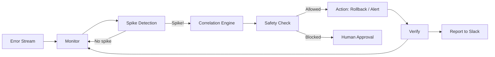

<p align="center">
  <h1 align="center">🛡️ Autonomous Feature Flag Remediation Agent</h1>
  <p align="center">
    <strong>Monitor error streams • Correlate with feature flags • Autonomously rollback dangerous deployments</strong>
  </p>
  <p align="center">
    
    
    
    
  </p>
</p>

---

**PostHog Flag Agent** is a Python-based MCP server and autonomous agent that watches your error streams in real-time, statistically detects anomalous spikes, correlates them with recent feature-flag deployments, and — when confident — **autonomously rolls back the offending flag** before your users even notice.

It plugs into PostHog's feature-flag and event APIs, exposes three MCP-compliant tools for human-in-the-loop interaction, and wraps everything in a production-grade safety system with rate limits, protected flags, and full audit trails.

---

## Architecture



```
┌─────────────────────────────────────────────────────────────┐
│                          MCP SERVER                         │
│  ┌────────────────┐ ┌────────────────┐ ┌────────────────┐   │
│  │ read_error_    │ │ check_flag_    │ │ toggle_feature │   │
│  │ logs           │ │ status         │ │ _flag          │   │
│  └────────┬───────┘ └────────┬───────┘ └────────┬───────┘   │
│           └──────────────────┼──────────────────┘           │
│                    PostHog API Client                        │
│              (async · retry · mock fallback)                │
└─────────────────────────────────────────────────────────────┘
                              │
              ┌───────────────┼───────────────┐
              ▼                               ▼
      Real PostHog API                   PostHog Mock
      (production)                       (simulator)
```

## Quick Start

```bash
# 1. Clone & install
git clone https://github.com/YOUR_USERNAME/posthog-flag-agent.git
cd posthog-flag-agent
pip install -e ".[dev]"

# 2. Configure (simulator mode — no API key needed)
cp .env.example .env

# 3. Run the demo
python -m src demo
```

That's it. The demo runs in simulator mode — no PostHog credentials required.

## How It Works — The 6-Phase Reasoning Loop

The agent operates in a continuous loop, executing six phases on every cycle:

### Phase 1: MONITOR
Every 30 seconds (configurable), the agent calls `read_error_logs` to fetch recent errors from PostHog's event stream.

### Phase 2: DETECT
The `ErrorMonitor` uses sliding-window statistical analysis to detect anomalies:
- Maintains a rolling baseline (mean + std) over 1 hour of error-rate history
- Buckets errors into 30-second windows for rate calculation
- Triggers when the current rate exceeds `mean + 3σ`
- Distinguishes sudden spikes from gradual increases

### Phase 3: CORRELATE
When a spike is detected, the `CorrelationEngine` runs three independent analyses:

| Signal | Weight | Method |
|--------|--------|--------|
| **Temporal** | 40% | How close was the flag change to the spike onset? |
| **Content** | 35% | Do error stack traces reference code paths related to the flag? |
| **Variant** | 25% | Are errors disproportionately affecting the treatment group? |

Each signal produces a 0.0–1.0 score, combined into a weighted confidence.

### Phase 4: DECIDE
Based on the confidence score:
- **≥ 0.85** → `AUTO_ROLLBACK` — disable the flag immediately
- **0.60–0.84** → `RECOMMEND_ROLLBACK` — alert the team via Slack
- **< 0.60** → `LOG_AND_MONITOR` — record and continue watching

### Phase 5: ACT
If auto-rollback is chosen:
1. The `SafetyGuard` validates the action against all constraints
2. The flag is disabled via `toggle_feature_flag`
3. An audit entry is recorded
4. An incident report is generated and posted to Slack

### Phase 6: VERIFY
After rollback, the agent continues monitoring for 5 minutes:
- If errors return to baseline → incident resolved
- If errors persist → escalate to human with full context

## MCP Server — Tool Reference

The server exposes three tools via the Model Context Protocol:

### `read_error_logs`
```
Parameters: time_window_minutes (int=5), severity (str="critical"), service (str|null)
Returns:    List of error entries with timestamps, stack traces, and metadata
```

### `check_flag_status`
```
Parameters: flag_key (str), include_variants (bool=True)
Returns:    Flag state — enabled, rollout %, variants, deployment time
```

### `toggle_feature_flag`
```
Parameters: flag_key (str), action ("enable"|"disable"|"rollback"), reason (str), rollout_percentage (int|null)
Returns:    Before/after state with audit entry — or safety-block reason
```

See [docs/mcp-specification.md](docs/mcp-specification.md) for full JSON schemas and examples.

### Claude Desktop Integration

```json
{
  "mcpServers": {
    "posthog-flag-agent": {
      "command": "python",
      "args": ["-m", "src.mcp_server.server"],
      "cwd": "/path/to/posthog-flag-agent"
    }
  }
}
```

## Configuration

All settings are configurable via environment variables (prefixed `AGENT_`) or a `.env` file:

| Variable | Default | Description |
|----------|---------|-------------|
| `POSTHOG_API_KEY` | `""` | PostHog personal API key |
| `POSTHOG_HOST` | `https://app.posthog.com` | PostHog instance URL |
| `POSTHOG_PROJECT_ID` | `1` | PostHog project ID |
| `POLL_INTERVAL_SECONDS` | `30` | Monitoring interval |
| `BASELINE_WINDOW_SECONDS` | `3600` | Baseline calculation window |
| `SPIKE_THRESHOLD_STD` | `3.0` | Standard deviations for spike detection |
| `CORRELATION_CONFIDENCE_AUTO_THRESHOLD` | `0.85` | Min confidence for auto-rollback |
| `CORRELATION_CONFIDENCE_ALERT_THRESHOLD` | `0.60` | Min confidence for alerting |
| `MAX_AUTO_ROLLBACKS_PER_HOUR` | `2` | Rate limit on autonomous actions |
| `COOLDOWN_AFTER_ROLLBACK_SECONDS` | `300` | Wait time after a rollback |
| `PROTECTED_FLAGS` | `[]` | Flags that can never be auto-toggled |
| `SLACK_WEBHOOK_URL` | `""` | Slack incoming webhook URL |
| `USE_SIMULATOR` | `true` | Use mock PostHog for local dev |
| `SIMULATION_SPEED` | `1.0` | Time acceleration factor |

## Safety Model

The agent enforces **defence-in-depth** safety:

1. **🔒 Protected flags** — Critical flags (billing, auth) can never be auto-toggled
2. **⏱️ Rate limiting** — Maximum 2 auto-rollbacks per hour (configurable)
3. **❄️ Cooldown** — 5-minute wait period after each rollback
4. **👤 Human gates** — Specific flags can require manual approval
5. **📊 Confidence floor** — Auto-action requires ≥85% confidence
6. **📝 Full audit trail** — Every decision is logged with reasoning

## Demo Scenarios

| Scenario | Command | What It Shows |
|----------|---------|---------------|
| Spike → Rollback | `python -m src demo` | Full autonomous remediation loop |
| No Correlation | `python examples/scenario_no_correlation.py` | Agent correctly avoids false-positive rollback |
| Safety Gate | `python examples/scenario_safety_gate.py` | Rate limit blocks third rollback, requests human approval |

See [docs/demo-walkthrough.md](docs/demo-walkthrough.md) for detailed expected output.

## Testing

```bash
# Run all tests with coverage
make test

# Quick run
pytest -v -x

# Individual test suites
pytest tests/test_correlation_engine.py -v
pytest tests/test_safety.py -v
pytest tests/test_mcp_tools.py -v
pytest tests/test_error_monitor.py -v
pytest tests/test_remediation_agent.py -v

# Linting & type checking
make lint
make typecheck
```

## Project Structure

```
posthog-flag-agent/
├── src/
│   ├── mcp_server/          # MCP server & tools
│   │   ├── server.py        # FastMCP server (stdio/SSE)
│   │   ├── tools.py         # Tool implementations
│   │   └── posthog_client.py # PostHog API client
│   ├── agent/               # Autonomous agent
│   │   ├── remediation_agent.py  # 6-phase reasoning loop
│   │   ├── error_monitor.py      # Spike detection
│   │   ├── correlation_engine.py # Multi-signal correlation
│   │   ├── incident_reporter.py  # Slack notifications
│   │   └── safety.py             # Safety boundaries
│   ├── simulator/           # Testing & demos
│   │   ├── error_stream.py  # Error generator
│   │   ├── posthog_mock.py  # Mock PostHog API
│   │   └── slack_webhook.py # Mock Slack receiver
│   ├── config.py            # Configuration (pydantic-settings)
│   └── models.py            # Shared data models
├── tests/                   # Comprehensive test suite
├── examples/                # Demo scenarios
└── docs/                    # Architecture & specification docs
```

## Contributing

1. Fork the repository
2. Create a feature branch (`git checkout -b feature/amazing-feature`)
3. Install dev dependencies (`pip install -e ".[dev]"`)
4. Make your changes
5. Run tests (`make test`)
6. Run linting (`make lint && make typecheck`)
7. Commit with clear messages
8. Open a Pull Request

### Code Standards

- Python 3.11+ with full type annotations
- Passes `mypy --strict`
- Formatted with `ruff format`
- Linted with `ruff check`
- All async code uses `asyncio` properly
- Structured logging via `structlog`

## License

MIT — see [LICENSE](LICENSE).
