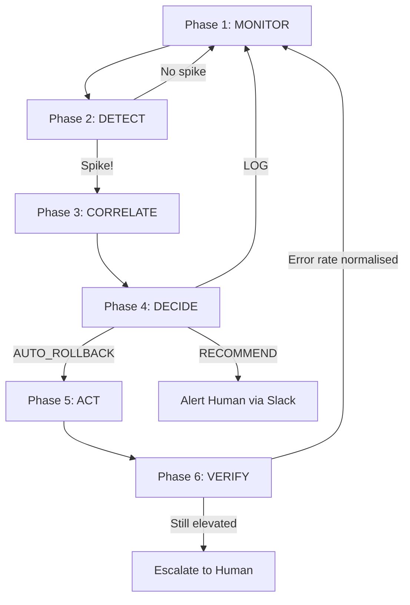

# Architecture — PostHog Feature Flag Remediation Agent

## System Design Overview

This document describes the architectural decisions, trade-offs, and design rationale behind the autonomous feature flag remediation agent.

## Why MCP?

The [Model Context Protocol (MCP)](https://modelcontextprotocol.io) was chosen as the tool interface for several reasons:

1. **Interoperability** — MCP is an open standard supported by Claude Desktop, Cursor, and other AI-native clients. By exposing our tools as MCP endpoints, any MCP client can invoke them.
2. **Structured tool schemas** — MCP requires JSON-schema tool definitions with descriptions, making the tools self-documenting.
3. **Transport flexibility** — MCP supports stdio (local) and SSE (remote) transports, so the server works in both CLI and web environments.
4. **Separation of concerns** — The MCP server is stateless infrastructure; the autonomous agent is a separate consumer of those tools. This means the tools can be used independently by a human operator via Claude Desktop **or** by the autonomous agent.

## Component Architecture

```
┌──────────────────────────────────────────────────────────┐
│                    MCP CLIENT (Claude Desktop / Agent)    │
└────────────────────┬─────────────────────────────────────┘
                     │ MCP Protocol (stdio / SSE)
┌────────────────────▼─────────────────────────────────────┐
│                    MCP SERVER (FastMCP)                   │
│  ┌──────────────┐ ┌──────────────┐ ┌──────────────────┐  │
│  │read_error_   │ │check_flag_   │ │toggle_feature_   │  │
│  │logs          │ │status        │ │flag              │  │
│  └──────┬───────┘ └──────┬───────┘ └──────┬───────────┘  │
│         │                │                │              │
│  ┌──────▼────────────────▼────────────────▼───────────┐  │
│  │              PostHog API Client                     │  │
│  │  (httpx async · retry · backoff · mock fallback)   │  │
│  └────────────────────────────────────────────────────┘  │
└──────────────────────────────────────────────────────────┘
         │                                    │
         ▼                                    ▼
 ┌───────────────┐                  ┌─────────────────────┐
 │  PostHog API  │  (production)    │  PostHogMock        │
 │  (real)       │                  │  (simulator)        │
 └───────────────┘                  └─────────────────────┘
```

## Agent Reasoning Loop

The autonomous agent follows a strict 6-phase loop:



## Statistical Methods

### Spike Detection (ErrorMonitor)

- **Method**: Sliding-window z-score analysis
- **Baseline**: Rolling mean of error counts over a configurable window (default 1 hour)
- **Threshold**: `mean + k * std` where k defaults to 3.0 standard deviations
- **Bucketing**: Errors are bucketed into time windows (default 30s) for rate calculation
- **Limitation**: Requires sufficient history (≥3 buckets) before detection activates. Gradual ramps that shift the mean won't trigger — this is by design.

### Correlation Scoring (CorrelationEngine)

Three independent signals are combined via weighted average:

| Signal | Weight | Method |
|--------|--------|--------|
| Temporal | 0.40 | Time delta between flag change and spike onset |
| Content | 0.35 | Keyword extraction from flag key → stack trace matching |
| Variant | 0.25 | Error-rate comparison between treatment and control cohorts |

**Limitations**:
- Content matching uses keyword extraction, not semantic analysis — it may miss indirect code-path relationships.
- Variant scoring requires flag variant metadata on errors; without it, the signal defaults to a neutral 0.3.

## Safety Model

The safety guard implements a defence-in-depth approach:

1. **Protected flags** — Critical flags (billing, auth) are never auto-toggled.
2. **Rate limiting** — Max N auto-rollbacks per hour (default 2).
3. **Cooldown** — Minimum wait time after a rollback before another can occur.
4. **Human-approval gate** — Specified flags require manual confirmation.
5. **Confidence threshold** — Actions below the auto-action threshold are blocked.
6. **No-op detection** — Prevents rolling back an already-disabled flag.

### Trade-off: Autonomy vs Safety

The thresholds are intentionally conservative. In production, teams should tune:
- `AGENT_SPIKE_THRESHOLD_STD` — Lower means faster detection but more false positives.
- `AGENT_CORRELATION_CONFIDENCE_AUTO_THRESHOLD` — Lower means more autonomous actions with less certainty.
- `AGENT_MAX_AUTO_ROLLBACKS_PER_HOUR` — Higher allows faster response to cascading failures.

## Data Flow

```
Error Source → PostHog Events API → read_error_logs
                                         │
                                    ErrorMonitor
                                    (sliding window)
                                         │
                                    SpikeEvent?
                                    │         │
                                   No        Yes
                                   │          │
                                 (wait)  check_flag_status (all recent)
                                              │
                                    CorrelationEngine
                                    (temporal + content + variant)
                                              │
                                    CorrelationResult
                                              │
                                    SafetyGuard.can_execute()
                                              │
                                    toggle_feature_flag
                                              │
                                    IncidentReporter
                                    (JSON + Slack Block Kit)
```

## Audit Trail

Every decision the agent makes — whether it acts, defers, or is blocked — is recorded in an append-only audit trail with:
- Timestamp
- Action proposed
- Decision (executed / blocked / deferred)
- Confidence score
- Full reasoning chain
- Outcome

This ensures complete observability and supports post-incident review.
